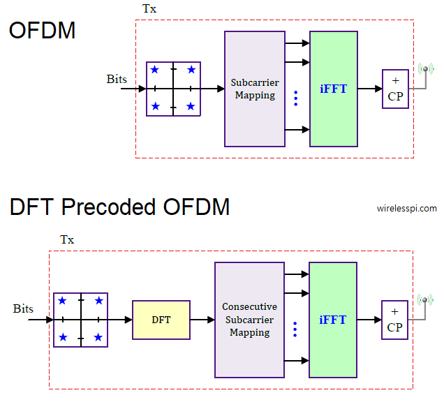
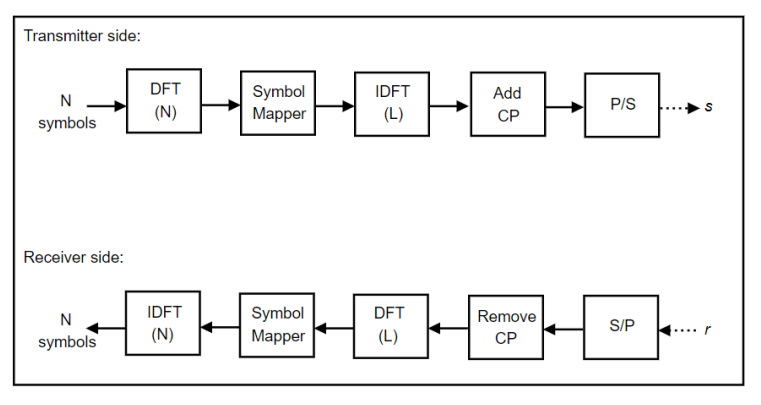
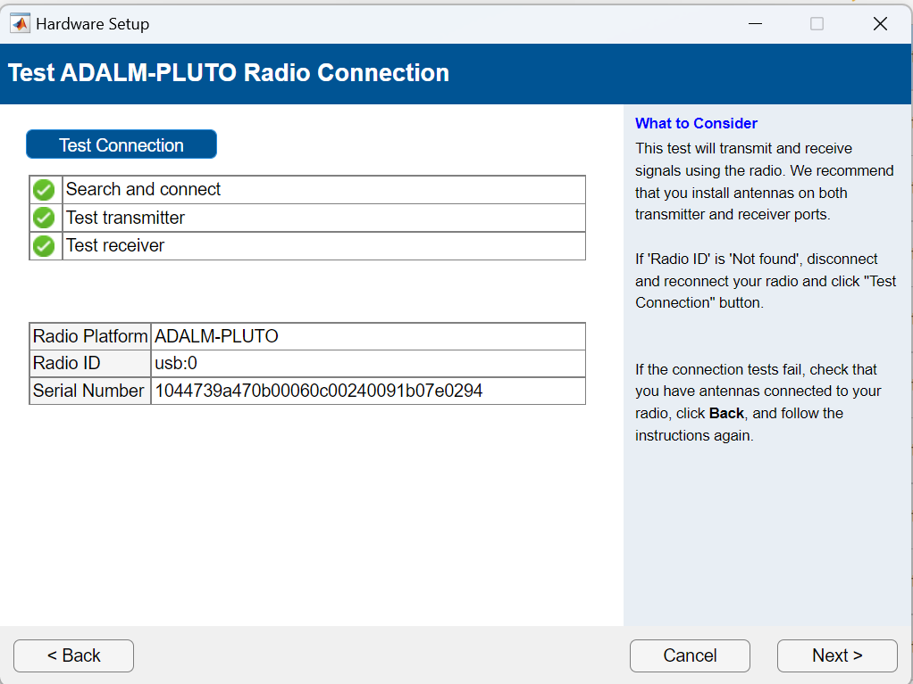
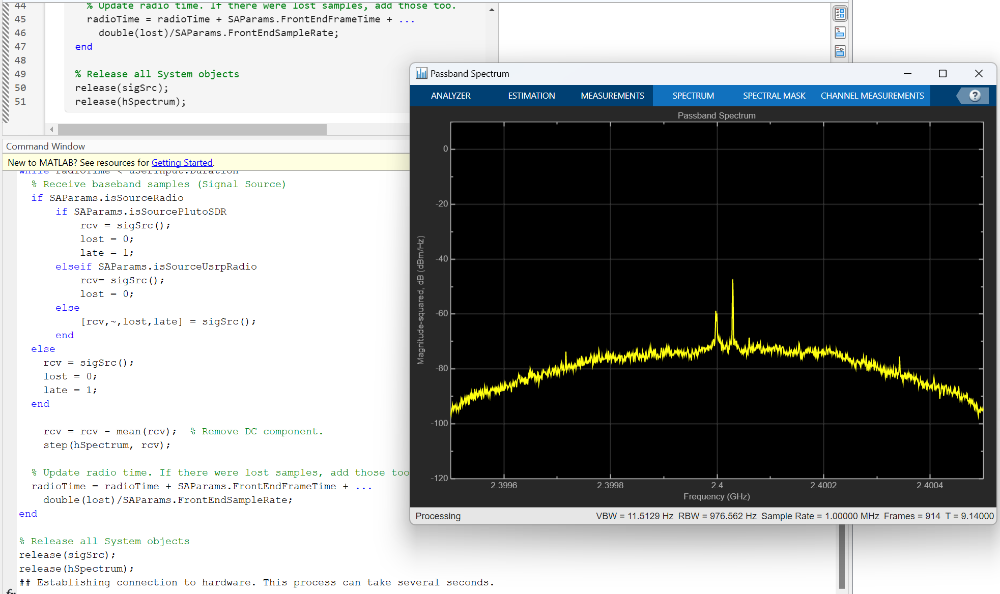

# Radarsensing

## MATLAB Simulation

### OFDM Communication
One of the problem of OFDM based communication is the high peak-to-average power ratio (PAPR) caused by IFFT. The peak power is proportional to IFFT length (L). We can minimize PAPR in UL via DFT. 

The DFT-S technique involves first passing the set of transmit symbols - got from a Q-ary alphabet like QAM or QPSK through a Discrete Fourier Transform (DFT) block, before they are mapped to the inputs of an Inverse Discrete Fourier Transform (IDFT) block. The DFT and IDFT operations are computed very efficiently using FFT and IFFT algorithms. The size of the IDFT block (L) is chosen to be an integer (K) multiple of the size of the DFT block.

The comparison of OFDM and DFTS-OFDM is shown here:


The DFTS-OFDM communication diagram is shown here:


Communication Sample code:
  * [simpleQAM](matlab/simpleQAM.mlx): test the basic QAM modulation, draw the Constellation Diagram
  * [simpleofdm](matlab/simpleofdm.mlx): simulates basic ofdm connection, test the BER
  * [80211ofdm](matlab/ofdm_communication.mlx): simulate the IEEE802.11 OFDM communication
  * [dfts_ofdm](matlab/dfts_ofdm.mlx): simulate the DFT-S OFDM to minimize PAPR in UL via DFT

The Constellation Diagram of the communication simulation:


### OFDM Radar
OFDM Radar diagram is shown here:


OFDM Radar Sample code:
  * [DFT-spread-OFDM Radar](matlab/periodogram_radar_dfts_one.mlx): Periodogram-based OFDM Radar with DFT-spread Single Target
  * [DFT-spread-OFDM Radar](matlab/periodogram_radar.mlx): DFT-spread-OFDM Radar simulation (two targets)

The simulation results of the DFTS-OFDM radar for two targets:


## ADALM-PLUTO Radio devices
ADALM-PLUTO is based on Analog Devices AD9363--Highly Integrated RF Agile Transceiver and Xilinx® Zynq Z-7010 FPGA
  * Website: https://www.analog.com/en/design-center/evaluation-hardware-and-software/evaluation-boards-kits/adalm-pluto.html#eb-overview
  * RF coverage from 325 MHz to 3.8 GHz
  * Up to 20 MHz of instantaneous bandwidth
  * up to 61.44 Mega Samples per Second (MSPS)

ADALM-PLUTO Overview: https://wiki.analog.com/university/tools/pluto

ADALM-PLUTO for End Users: https://wiki.analog.com/university/tools/pluto/users
  * libiio USB device for communicating to the RF device
  * enumerate with the 192.168.2.1 IP address by default.
  * provides access to the Linux console on the Pluto device via USB Communication Device Class Abstract Control Model (USB CDC ACM) specification
  * Windows driver: https://wiki.analog.com/university/tools/pluto/drivers/windows
  * Linux driver: https://wiki.analog.com/university/tools/pluto/drivers/linux
  * MATLAB: https://www.mathworks.com/hardware-support/adalm-pluto-radio.html
    * Install Support Package for Analog Devices ADALM-PLUTO Radio: https://www.mathworks.com/help/supportpkg/plutoradio/ug/install-support-package-for-pluto-radio.html
    * Setup: https://www.mathworks.com/help/supportpkg/plutoradio/ug/guided-host-radio-hardware-setup.html
    * Manual Setup: https://www.mathworks.com/help/supportpkg/plutoradio/ug/manual-host-radio-hardware-setup.html
  * PlutoSDR (using python bindings to libiio): https://github.com/radiosd/PlutoSdr
  * pyadi-iio: https://wiki.analog.com/resources/tools-software/linux-software/pyadi-iio, https://analogdevicesinc.github.io/pyadi-iio/
  * GNU Radio and IIO Devices: gr-iio: https://wiki.analog.com/resources/tools-software/linux-software/gnuradio
  * Accessing Pluto's FPGA Over JTAG: https://wiki.analog.com/university/tools/pluto/devs/fpga
  * HDL code: https://github.com/analogdevicesinc/hdl/tree/master/projects/pluto

https://ez.analog.com/ez-blogs/b/engineerzone-spotlight/posts/how-to-construct-a-beamformer-with-the-adalm-pluto

https://wiki.analog.com/resources/tools-software/linux-software/libiio_internals#high-speed_mmap_interface

https://github.com/analogdevicesinc/libiio

ADI Book Software-Defined Radio for Engineers, 2018: https://www.analog.com/en/education/education-library/software-defined-radio-for-engineers.html

Analog Devices Board Support Packages Toolbox For MATLAB and Simulink: https://wiki.analog.com/resources/eval/user-guides/matlab_bsp

PlutoSDR quick start: https://wiki.analog.com/university/tools/pluto/users/quick_start
  * Download windows driver from: https://github.com/analogdevicesinc/plutosdr-m2k-drivers-win/releases
  * The terminal settings are 115200 baud, 8 bits, no parity, 1 stop bit. This is referred to as 115200-8N1. The default username is root, and the default root password is analog.
  * The IP number is set by the device, and can be found by looking inside the ADALM-PLUTO's mass storage device, and the info.html page.
  * Checking from serial port: ifconfig usb0
  * Check IIO devices "iio_info -s", "iio_attr -a -C"

```bash 
(mycondapy310) PS D:\Developer\radarsensing> iio_attr -a -C fw_version   
Using auto-detected IIO context at URI "usb:2.46.5"
fw_version: v0.35
(mycondapy310) PS D:\Developer\radarsensing> iio_info -u ip:192.168.2.16
(mycondapy310) PS D:\Developer\radarsensing> ssh root@192.168.2.16 #ssh root@pluto.local
#password: analog
iio_info -u "ip:192.168.1.10"
ssh root@192.168.1.10 #password: analog
v0.34-dirty
https://github.com/MicroPhase/antsdr-fw
# fw_printenv attr_name
attr_name=compatible
# fw_printenv attr_val
attr_val=ad9361
# fw_printenv compatible
compatible=ad9361
# fw_printenv mode
mode=2r2t
```
Follow this link: https://wiki.analog.com/university/tools/pluto/users/customizing#updating_to_the_ad9364, to enable the second channel. Current PlutoSDR is Rev.C
```bash 
ssh root@pluto.local
#password: analog
v0.37
https://wiki.analog.com/university/tools/pluto

# fw_setenv attr_name compatible
# fw_setenv attr_val ad9361
# fw_setenv compatible ad9361
# fw_setenv mode 2r2t
# reboot
```

Upgrade the firmware: https://wiki.analog.com/university/tools/pluto/users/firmware


After the driver installation, the pluto device can be connected and tested via ADI IIO:


Install IIO_oscilloscope: https://wiki.analog.com/resources/tools-software/linux-software/iio_oscilloscope

The spectrum diagram from IIO:


The pluto device is also connected via terminal (tera term):
(imgs/plutoterminal.png)

### Radio setup in MATLAB 
Connect the radio device to MATLAB and perform connect test:




Write the radio test code for RX and TX: [sdrmatlab/plutoradio.mlx], [sdrmatlab/radioreceive.mlx], [sdrmatlab/radiotransmit.mlx]

Use the radio to perform spectrum test via code [spectrumanalysis](sdrmatlab/spectrumanalysis.mlx)


We also tested the transmission of OFDM waveform in Radar mode and analyze the spectrum: [sdrmatlab/OFDMRadar.m], the spectrum result is shown here.

When antenna is not attached:


When antenna is attached, we can see the received signal spectrum:


### Python interface
PyADI-IIO: https://wiki.analog.com/resources/tools-software/linux-software/pyadi-iio

```bash 
conda install -c conda-forge pylibiio
pip install pyadi-iio
pip install matplotlib
pip install scipy
pip install PyQt5
pip install pyqtgraph

pip install kiwisolver
pip install Pillow
pip install numpy matplotlib
conda install pyqtgraph 
conda install -c anaconda pyqt 
conda install -c anaconda numpy
pip install pygame
conda install -c anaconda pandas
```

Test throughput
```bash 
(mycondapy310) PS D:\Developer\radarsensing> iio_readdev -u ip:pluto.local -B -b 65768 cf-ad9361-lpc
Throughput: 22 MiB/s
```
